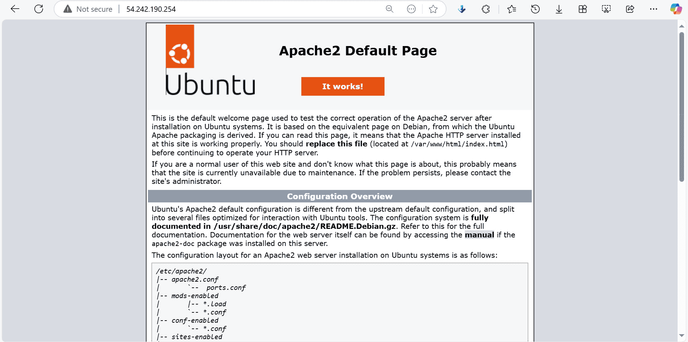

# Landing Page in the Cloud: A Hands-On Guide to AWS EC2 and Linux Server Deployment 🐧☁️

Hello and welcome to my Linux-powered landing page project, deployed on an EC2 instance in AWS. In this project, I had the opportunity to dive into provisioning a cloud server, setting up a web server, and deploying a simple landing page to showcase my skills. Let me walk you through how I brought it all together.
## Check Out the Web Page

Before we dive into the details, want to see it live? Click below to check out my deployed landing page:

**Secure HTTPS URL**: [https://web.izuchukwu.mooo.com](https://web.izuchukwu.mooo.com)

**Public IP Address**: [18.214.150.124](http://18.214.150.124/)

**Note**:
- *When accessing websites, always prefer using the HTTPS version for a more secure experience. It encrypts your connection, ensuring your data remains safe while browsing.* 
- *The server is temporary and may be taken down shortly. If the instance is stopped, the server will be unavailable, and the links above may not work until the instance is restarted.*
- *If the instance is **terminated**, the IP address associated to this url will no longer be available.*

📸 Here’s a snapshot of the landing page you’ll be visiting. 


### 🛠️ How I Built It
**Step 1:** Provisioning the Server 

I started by provisioning an EC2 instance on AWS. I went with the Ubuntu Server 22.04 LTS AMI, selected the t2.micro instance type (free-tier eligible), and set up a Key Pair for secure SSH access.

**Steps Taken:**

- Logged into the AWS Management Console, searched for and accessed EC2 (Elastic Compute Cloud).
- Created a new EC2 instance using the Ubuntu Server 22.04 LTS AMI.
- Selected t2.micro as the instance type (free for 750 hrs per month and suitable for small workloads)
- Configured a Key Pair for SSH access and saved the .pem file.
- Allowed HTTP (port 80) and SSH (port 22), and HTTPS (port 443) traffic in the Security Group.
- Launched the instance and connected via SSH on a CLI (Git Bash):

```bash
ssh -i "Alexkey.pem" ubuntu@my-public-ip
```
**Step 2: Installing Apache** 

To serve my page, I needed a web server. I installed Apache on the server and made sure it started automatically whenever the server booted up.

**Steps Taken:**

- Updated the server packages with the following commands:
```bash
sudo apt update && sudo apt upgrade -y
```
- Installed Apache:
```bash
sudo apt install apache2 -y
```
- Started and enabled Apache to run on boot:
```bash
sudo systemctl start apache2
sudo systemctl enable apache2
```
- Verified everything was working by visiting the public IP in a browser. 

Snapshot of Apache installed and running 📸


**Note**: 
*I have attached an Elastic IP to the EC2 instance. The public IP shown in the image is not accessible, as Elastic IPs carry a different IP address.*

### Step 3: Deploying the Landing Page 💻

Next, I deployed the index.html landing page. I created this file in the server’s root directory and added a little introduction about me and a brief description of this project.

**Steps Taken:**

- Navigated to the web server’s root directory:
```bash
cd /var/www/html
```
- Created the index.html file:
```bash
sudo nano index.html
```
- Added the following HTML content: (Snapshot below)


- Adjusted permissions to ensure Apache could serve the file using the command:
```bash
sudo chmod 644 index.html
```
**Step 4: Configuring Networking** 🌍

I needed to make sure the world could access my landing page, so I updated the Security Group to allow HTTP (port 80) traffic on the AWS Management Console. Then, I tested it by visiting the public IP in a browser.

**Steps Taken:**

- Edited the Security Group of my EC2 instance to allow HTTP traffic from anywhere.
- Tested by accessing the page via the public IP: [http://web.izuchukwu.mooo.com](https://web.izuchukwu.mooo.com)
    
Here is a snapshot 📸


### Bonus Step: Setting Up HTTPS 🔒

For extra security, I set up HTTPS using Let’s Encrypt. This ensures visitors can access the page over a secure connection. I got a subdomain on a free DNS hosting provider (https://freedns.afraid.org) to complete this process.

**Steps Taken:**

- Installed Certbot for Apache:
```bash
sudo apt install certbot python3-certbot-apache -y
```
- Configured HTTPS with Let’s Encrypt:
```bash
sudo certbot --apache
```
    
#### Live Demo
Verified secure access via:

- **The Deployed Landing Page (Secure HTTPS Link)**: [https://web.izuchukwu.mooo.com](https://web.izuchukwu.mooo.com)

*For visual reference, see the snapshot at the beginning of this README to view the landing page in action.*


### What’s Inside the Repository 📦 
Here’s a rundown of what you’ll find in this repository:

- Public IP Address(secure): https://web.izuchukwu.mooo.com
- Snapshots: Images showcasing the deployed landing page and various steps involved in provisioning the landing page on a Linux server.
- Documentation: This README.md file with all the details.
- Git Repository: Includes:
    - index.html
    - images
    - README.md

### Wrapping Up 🏁 
This project was a valuable experience in diving into server provisioning, web server setup, and cloud-based web deployment. I hope you enjoyed seeing my process. Feel free to check out the page and let me know your thoughts! 💬

## Useful Resources

- [AWS Amazon EC2 Documentation](https://docs.aws.amazon.com/ec2/)
- [Free DNS ](https://freedns.afraid.org/)